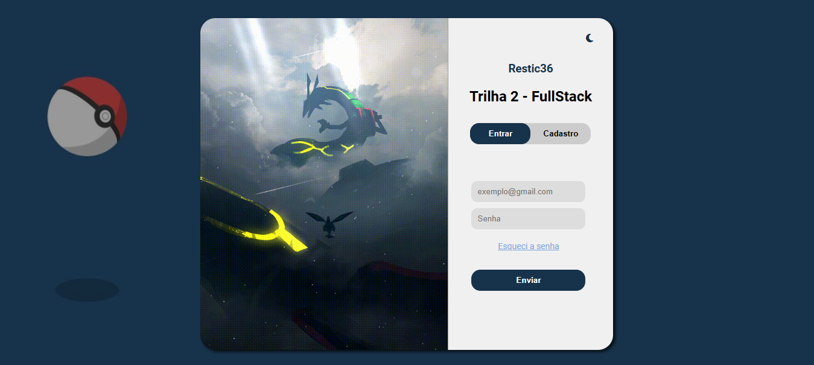

# Trilha 2 FullStack - Unidade 03 - Projeto 01



## Descrição do Projeto

Este projeto é uma aplicação web interativa que simula um sistema de login e registro. Ele utiliza HTML, CSS, e TypeScript para criar uma interface responsiva e dinâmica, com transições suaves, tema alternável entre claro e escuro, e uma modificação visual personalizada para o fundo do modal com base na seleção do usuário.

## Instruções de Como Executar a Aplicação

Para executar a aplicação, siga os passos abaixo:

1. Clone este repositório em sua máquina local usando o seguinte comando:
   ```bash
   git clone git@github.com:viniccius-dev/restic36-projeto-01-unidade-03.git

2. Navegue até o diretório do projeto:
   ```bash
   cd seu-repositorio

3. Compile o arquivo TypeScript para JavaScript usando o TypeScript Compiler (TSC):
   ```bash
   tsc transition.ts

4. Abra o arquivo index.html no seu navegador de preferência. Não é necessário instalar qualquer dependência adicional, já que o projeto é inteiramente baseado em HTML, CSS e TypeScript.

## Tecnologias Utilizadas

- **HTML5**: Usado para estruturar a aplicação.
- **CSS3**: Usado para estilização da interface, com foco em responsividade e temas dinâmicos.
- **TypeScript**: Usado para adicionar interatividade à aplicação, manipulando o DOM e gerenciando eventos de usuário.

## Possíveis Melhorias Futuras

Algumas melhorias que podem ser implementadas no futuro incluem:

- **Integração com uma API real** para autenticação de usuários, permitindo que os dados de login e registro sejam persistidos em um banco de dados.
- **Validação mais robusta de formulários** para garantir que os dados inseridos pelos usuários sejam válidos antes do envio.
- **Animações mais avançadas** para transições de tela e mudanças de tema, utilizando bibliotecas como GSAP ou animações CSS mais complexas.
- **Testes unitários e de integração** para garantir a robustez do código TypeScript.

---

Este é um projeto simples, mas que utiliza práticas modernas de desenvolvimento front-end, sendo uma boa base para adicionar novas funcionalidades e aprender mais sobre desenvolvimento web.
